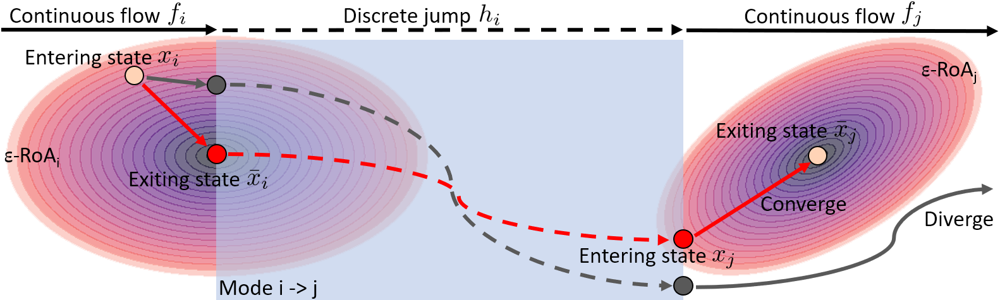
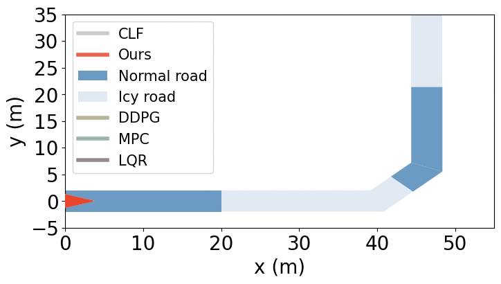

# Hybrid Systems Neural Control with Region-of-Attraction Planner


[](https://l4dc.seas.upenn.edu/)
[](https://arxiv.org/abs/2303.10327)

[<ins>Reliable Autonomous Systems Lab @ MIT (REALM)</ins>](https://aeroastro.mit.edu/realm/)

[<ins>Yue Meng</ins>](https://mengyuest.github.io/), [<ins>Chuchu Fan</ins>](https://chuchu.mit.edu/)


> A neural network policy learning framework to stabilize hybrid systems for robots, inspired by Lyapunov theory and Region-of-Attraction (RoA). We aim to ensure the system states always fall into the RoA of corresponding system modes.



Fig.1 Learn to stablize hybrid systems using an RoA based approach.


This repository contains the implementation for our L4DC2023 paper, "Hybrid Systems Neural Control with Region-of-Attraction Planner." [[link]](https://arxiv.org/abs/2309.05131.pdf)

```
@inproceedings{meng2023hybrid,
  title={Hybrid Systems Neural Control with Region-of-Attraction Planner},
  author={Meng, Yue and Fan, Chuchu},
  booktitle={Learning for Dynamics and Control Conference},
  pages={1400--1415},
  year={2023},
  organization={PMLR}
}
```



Gif.1 Control a car driving safely on normal/icy road.


Gif.2 Control a pogobot to safely jump through a 2D maze.


Gif.3 Control a bipedal walker to walk in different gaits.


## Prerequisite
Ubuntu 18.04, Nvidia GTX 2080Ti

### Packages installation:
```shell
conda install numpy matplotlib tqdm scipy h5py
conda install -c conda-forge qpsolvers casadi
conda install pytorch torchvision torchaudio cudatoolkit=11.1 -c pytorch-lts -c nvidia
conda install tensorboard
pip install gym==0.17.2
cd baseline_rl && pip install -e . && cd ..
cd baseline_mbrl && pip install -e . && cd ..
```

### Model/Data preparation
Download all the pretrained models `exps_cyclf.zip` and necessary data `walker.zip` from [Google Drive](https://drive.google.com/drive/folders/101wBUH-M9y-tbCQ_HE_PdRNEswRrcVha?usp=sharing) and extract them in `exps_cyclf` and `walker` under the project directory.


## Main evaluation experiments
### Car experiment (figure 4 in our paper)
```shell
# (from package directory)
cd car
python car_planner.py --exp_name CAR_25X --gpus 0 --dt 0.01 --nt 100 --num_samples 10000 --joint_pretrained_path g0128-111623_JOI_ROA_U12_SA_grow --net_pretrained_path g0128-125740_EST_grow --mono_actor_pretrained_path g0511-000521_JOI_ROA_U12_SA_grow_singleclf_one --u_limit 8 8 --allow_factor 1.0 --cap_seg 16 --num_workers 1 --skip_viz 100 --use_sample --lqr_nt 100 --clf_nt 120 --use_middle --new_ring_seg 10 --race --race_angle 30 --num_trials 25 --methods mbpo mbpo mbpo rl-sac rl-sac rl-sac rl-ppo rl-ppo rl-ppo rl-ddpg rl-ddpg rl-ddpg mpc lqr clf ours ours-d --auto_rl --mbpo_paths g1124-015808_car_mbpo_1007 g1124-015809_car_mbpo_1008 g1124-015811_car_mbpo_1009
```

### Pogo experiment (figure 6)
```shell
# (from package directory)
cd pogo
python beta_plan.py --exp_name Pp_25X_d --gpus 0 --normalize --viz_freq 500 --data_path g0208-214752_Pda_10M --dyna_pretrained_path g0208-222845_Pfit --actor_pretrained_path g0209-012818_Pclf_mgn --clf_pretrained_path g0209-012818_Pclf_mgn --net_pretrained_path g0209-112138_Proa --methods mbpo mbpo mbpo rl-sac rl-sac rl-sac rl-ppo rl-ppo rl-ppo rl-ddpg rl-ddpg rl-ddpg mpc ours ours-d --num_trials 25 --auto_rl --mbpo_paths g1124-074642_beta_mbpo_1007 g1124-091519_beta_mbpo_1008 g1124-093210_beta_mbpo_1009
```


### Bipedal experiment (figure 8(a) (b))
```shell
# (from package directory)
python cgw_plan_new.py --exp_name cgw_plan_20X6_d --gpus 0 --num_samples 20 --dx_mins -0.01 -0.02 -0.1 -0.2 --dx_maxs 0.01 0.02 0.1 0.2 --roa_thres 0.05 --th_thres 0.01 --n_try 10 --ours_clf_paths g0424-150358_cwg_train_clf_bdry --methods mbpo mbpo mbpo rl-sac rl-sac rl-sac rl-ddpg rl-ddpg rl-ddpg rl-ppo rl-ppo rl-ppo mpc qp hjb ours ours-d --gait_subset 1 2 3 4 5 6 7 --auto_rl --mbpo_paths g1124-103144_bp_mbpo_1007 g1124-114225_bp_mbpo_1008 g1124-124619_bp_mbpo_1009

python cgw_plan_new.py --exp_name cgw_10x11x13MUL_d --gpus 0 --num_samples 10 --dx_mins -0.01 -0.02 -0.1 -0.2 --dx_maxs 0.01 0.02 0.1 0.2 --roa_thres 0.05 --th_thres 0.01 --n_try 10 --ours_clf_paths g0424-150358_cwg_train_clf_bdry --methods mbpo mbpo mbpo rl-sac rl-sac rl-sac rl-ddpg rl-ddpg rl-ddpg rl-ppo rl-ppo rl-ppo mpc qp ours ours-d --gait_subset 1 2 3 4 5 6 7 8 9 10 11 --multi_target --tgt_gait_subset 1 2 3 4 5 6 7 8 9 10 11 12 13 14 --filtered --auto_rl --mbpo_paths g1124-103144_bp_mbpo_1007 g1124-114225_bp_mbpo_1008 g1124-124619_bp_mbpo_1009
```

## More experiments for training
> You can also check the log inside each pretrained model directory for the training commands

### Training for our method
``` shell
# Change the seed to generate multiple pretrained models
################ EXP-1 Car tracking ################
# Controller pretrain (g0128-012244_R_actor_U12)
python car_clf_train.py --exp_name R_actor_U12 --gpus 0 --num_samples 1000 --dt 0.01 --nt 100 --cutoff_norm 0.5 --mu_choices 1.0 0.1 --u_limit 12.0 12.0 --actor_nn_res_ratio 0.3 --ref_mins 3.0 -0.0 --ref_maxs 30.0 0.0 --skip_clf_pretraining --load_last --actor_hiddens 256 256 --actor_pretrain_rel_loss --actor_pretrain_traj --actor_pretrain_mask --skip_training --always_new_sampling

# CLF pretrain (g0128-012128_R_PRET12_clf256)
python car_clf_train.py --exp_name R_PRET12_clf256 --gpus 0 --num_samples 10000 --dt 0.01 --nt 100 --cutoff_norm 0.5 --s_mins -1.0 --s_maxs 1.0 --mu_choices 1.0 0.1 --ref_mins 3.0 -0.0 --ref_maxs 30.0 0.0 --u_limit 12 12 --actor_nn_res_ratio 0.3 --clf_hiddens 256 256 --clf_pretrain_mask --skip_actor_pretraining --skip_training

# Joint CLF+Controller finetune (g0128-111623_JOI_ROA_U12_SA_grow)
python car_clf_train.py --exp_name JOI_ROA_U12_SA_grow --gpus 0 --dt 0.01 --nt 100 --roa_iter 1000 --cutoff_norm 0.5 --actor_nn_res_ratio 0.3 --mu_choices 1.0 0.1 --ref_mins 3.0 -0.0 --ref_maxs 30.0 0.0 --num_samples 1000 --clf_hiddens 256 256 --skip_clf_pretraining --clf_pretrained_path g0128-012128_R_PRET12_clf256 --actor_hiddens 256 256 --skip_actor_pretraining --actor_pretrained_path g0128-012244_R_actor_U12 --u_limit 12 12 --new_sampling --train_clf_batch --train_actor_resampling --no_viz --always_new_sampling --roa_multiplier 5 --alpha_v 0.05 --actor_setups 0.0001 500 50 250 --use_v_for_stable --relative_roa_scale 0.1 --max_v_thres 0.1 --traj_roa_alpha 0.01 --statewise_actor_training --skip_clf_training --graduate_growing

# Train RoA (g0128-125740_EST_grow)
python car_roa_estimator.py --exp_name EST_grow --gpus 0 --dt 0.01 --nt 100 --cutoff_norm 0.5 --actor_nn_res_ratio 0.3 --mu_choices 0.1 0.1 --ref_mins 3.0 -0.0 --ref_maxs 30.0 0.0 --num_samples 10000 --clf_hiddens 256 256 --joint_pretrained_path g0128-111623_JOI_ROA_U12_SA_grow --actor_hiddens 256 256 --u_limit 12 12 --net_hiddens 256 256 --num_configs 1000 --net_setups 1e-4 50000 500 10000 1000 --use_v_for_stable --relative_roa_scale 0.1 --max_v_thres 0.1 --alpha_v 0.05 --traj_roa_alpha 0.01


################ EXP-2 Pogobot navigation ################
# Collect data (g0208-214752_Pda_10M)
python beta_collect.py --exp_name Pda_10M --num_samples 100000 --xmins 0.0 -5 1.01 0.0 --xmaxs 0.0 5 5.0 0.0 --umins -0.8 -5000.0 --umaxs 0.8 5000.0 --num_trials 100

# Fit dynamic model (g0208-222845_Pfit)
python beta_fit.py --exp_name Pfit --gpus 0 --hiddens 64 64 64 --lr 0.1 --data_path g0208-214752_Pda_10M --epochs 300000 --print_freq 1000 --save_freq 5000 --batch_size 4096 --normalize

# Train CLF (g0209-012818_Pclf_mgn)
python beta_train.py --exp_name Pclf_mgn --gpus 0 --hiddens 64 64 64 --dyna_pretrained_path g0208-222845_Pfit --lr 0.05 --data_path g0208-214752_Pda_10M --epochs 100000 --print_freq 100 --viz_freq 1000 --save_freq 5000 --batch_size 1024 --clf_hiddens 64 64 64 --actor_hiddens 64 64 64 --multi --actor_e2e --ref_mins -2.0 1.5 --ref_maxs 2.0 4.0 --err_mins -0.5 -0.5 --err_maxs 0.5 0.5 --tanh_w_gain 0.8 --tanh_a_gain 3000.0 --normalize --cls_weight 0.0 --alpha_v 0.5 --norm_thres 0.1 --v_margin 0.0001 --clf_ell_eye --clf_eye_scale 0.01 --train_intervals 100 0 --u_norm --split_ratio 0.95 --vio_thres 50 --roa_bloat 1.0 --train_alpha_v 0.75 --abs_mins -5.0 1.01 --abs_maxs 5.0 5.0

# Train RoA (g0209-112138_Proa)
python beta_train.py --exp_name Proa --gpus 0 --hiddens 64 64 64 --dyna_pretrained_path g0208-222845_Pfit --lr 0.05 --data_path g0208-214752_Pda_10M --epochs 100000 --print_freq 100 --viz_freq 1000 --save_freq 5000 --batch_size 1024 --clf_hiddens 64 64 64 --actor_hiddens 64 64 64 --multi --actor_e2e --ref_mins -2.0 1.5 --ref_maxs 2.0 4.0 --err_mins -0.5 -0.5 --err_maxs 0.5 0.5 --tanh_w_gain 0.8 --tanh_a_gain 3000.0 --normalize --cls_weight 0.0 --alpha_v 0.5 --norm_thres 0.1 --v_margin 0.0001 --clf_ell_eye --clf_eye_scale 0.01 --train_intervals 100 0 --u_norm --split_ratio 0.95 --vio_thres 5 --roa_bloat 1.0 --train_alpha_v 0.75 --estimate_roa --actor_pretrained_path g0209-012818_Pclf_mgn --clf_pretrained_path g0209-012818_Pclf_mgn --net_setups 0.001 50000 1000 5000 1000 --net_hiddens 64 64 --net_rel_loss --net_num_configs 50000 --net_exp --abs_mins -5.0 1.01 --abs_maxs 5.0 5.0

################ EXP-3 Bipedal walker ################
# Train CLF + RoA (g0424-150358_cwg_train_clf_bdry)
python cgw_train.py --exp_name cwg_train_clf_bdry --gpus 0 --num_epochs 50000 --dx_min -0.05 -0.1 -0.25 -0.5 --dx_max 0.05 0.1 0.25 0.5 --n_trials 200 --print_freq 100 --save_freq 100 --viz_freq 500 --lr 0.001 --nn_ratio 0.0 --regen_init --regen_freq 500 --w_dec 0 --w_dq1 0 --clf_only --not_plot_phase --gait_idx_begin 0 --gait_idx_end 29 --n_theta 29 --nt 200 --pos_thres 0.95 --neg_thres 1.05
```

### Training for Mono-CLF in car experiment
``` shell
# Change the seed to generate multiple pretrained models
################ EXP-1 Car tracking ################
# Controller pretrain (g0128-012244_R_actor_U12)
python car_clf_train.py --exp_name R_actor_U12 --gpus 0 --num_samples 1000 --dt 0.01 --nt 100 --cutoff_norm 0.5 --mu_choices 1.0 0.1 --u_limit 12.0 12.0 --actor_nn_res_ratio 0.3 --ref_mins 3.0 -0.0 --ref_maxs 30.0 0.0 --skip_clf_pretraining --load_last --actor_hiddens 256 256 --actor_pretrain_rel_loss --actor_pretrain_traj --actor_pretrain_mask --skip_training --always_new_sampling

# CLF pretrain (g0511-000404_PRET12_single_clf_1)
python car_clf_train.py --exp_name PRET12_single_clf_1 --gpus 0 --num_samples 10000 --dt 0.01 --nt 100 --cutoff_norm 0.5 --s_mins -1.0 --s_maxs 1.0 --mu_choices 1.0 1.0 --ref_mins 10.0 -0.0 --ref_maxs 10.0 0.0 --u_limit 12 12 --actor_nn_res_ratio 0.3 --clf_hiddens 256 256 --clf_pretrain_mask --skip_actor_pretraining --skip_training --single_clf

# Joint CLF+Controller finetune (put those two pretrained directory to the followings --flags (--clf_pretrained_path / --actor_pretrained_path))  | g0511-000521_JOI_ROA_U12_SA_grow_singleclf_one
python car_clf_train.py --exp_name JOI_ROA_U12_SA_grow_singleclf_one --gpus 0 --dt 0.01 --nt 100 --roa_iter 1000 --cutoff_norm 0.5 --actor_nn_res_ratio 0.3 --mu_choices 1.0 0.1 --ref_mins 3.0 -0.0 --ref_maxs 30.0 0.0 --num_samples 1000 --clf_hiddens 256 256 --skip_clf_pretraining --clf_pretrained_path g0511-000404_PRET12_single_clf_1 --actor_hiddens 256 256 --skip_actor_pretraining --actor_pretrained_path g0128-012244_R_actor_U12 --u_limit 12 12 --new_sampling --train_clf_batch --train_actor_resampling --no_viz --always_new_sampling --roa_multiplier 5 --alpha_v 0.05 --actor_setups 0.0001 500 50 250 --use_v_for_stable --relative_roa_scale 0.1 --max_v_thres 0.1 --traj_roa_alpha 0.01 --statewise_actor_training --skip_clf_training --graduate_growing --single_clf
```

### Training for RL baselines
``` shell
# Change the seed to generate multiple pretrained models
################ EXP-1 Car tracking ################
python global_patch.py --algor sac --exp_name car --gpus 0 --env_id CarEnv-v0 --max_iter 100000 --save_iter 100 --random_seed 1007 --num_process 16
python global_patch.py --algor ppo --exp_name car --gpus 0 --env_id CarEnv-v0 --max_iter 100000 --save_iter 100 --random_seed 1007 --num_process 4
python global_patch.py --algor ddpg --exp_name car --gpus 0 --env_id CarEnv-v0 --max_iter 100000 --save_iter 100 --random_seed 1007 --num_process 4

################ EXP-2 Pogobot navigation ################
python global_patch.py --algor sac --exp_name beta --gpus 0 --env_id BetaEnv-v0 --max_iter 100000 --save_iter 100 --random_seed 1007 --num_process 4 --nn_sim
python global_patch.py --algor ppo --exp_name beta --gpus 0 --env_id BetaEnv-v0 --max_iter 100000 --save_iter 100 --random_seed 1007 --num_process 1 --nn_sim
python global_patch.py --algor ddpg --exp_name beta --gpus 0 --env_id BetaEnv-v0 --max_iter 100000 --save_iter 100 --random_seed 1007 --num_process 4 --nn_sim


################ EXP-3 Bipedal walker ################
python global_patch.py --algor sac --exp_name bp --gpus 0 --env_id BpEnv-v0 --max_iter 100000 --save_iter 100 --random_seed 1007 --num_process 1
python global_patch.py --algor ppo --exp_name bp --gpus 0 --env_id BpEnv-v0 --max_iter 100000 --save_iter 100 --random_seed 1007 --num_process 1
python global_patch.py --algor ddpg --exp_name bp --gpus 0 --env_id BpEnv-v0 --max_iter 100000 --save_iter 100 --random_seed 1007 --num_process 1
```

### Training for MBRL baselines
``` shell
# Change the seed to generate multiple pretrained models
################ EXP-1 Car tracking ################
python train_bsl.py algorithm=mbpo overrides=mbpo_car seed=1007 device="cuda:0"

################ EXP-2 Pogobot navigation ################
python train_bsl.py algorithm=mbpo overrides=mbpo_beta seed=1007 device="cuda:0"

################ EXP-3 Bipedal walker ################
python train_bsl.py algorithm=mbpo overrides=mbpo_bp seed=1007 device="cuda:0"
```